# SpeedOrder ⚡

Welcome to the **SpeedOrder**! This platform allows you to browse, select, and purchase products online, and have them delivered directly to your doorstep. With seamless payment options like PayPal and Visa, shopping has never been easier. Simply choose your products, provide your location, and let us handle the rest!

---

## Features

- **Product Selection**: Browse through a wide range of products and add them to your cart.
- **Location-Based Delivery**: Enter your location, and we'll ensure your products are delivered to your home.
- **Secure Payments**: Pay conveniently and securely via PayPal or Visa.
- **Fast Delivery**: Enjoy quick and reliable delivery services.
- **User-Friendly App**: Easy-to-use interface for a smooth shopping experience.

---

## How It Works

1. **Sign Up/Log In**: Create an account or log in to your existing one.
2. **Browse Products**: Explore our catalog and add items to your cart.
3. **Enter Location**: Provide your delivery address.
4. **Checkout**: Pay securely using PayPal or Visa.
5. **Delivery**: Sit back and relax while we deliver your products to your doorstep.

---

## Payment Methods

We support the following payment options:

- **PayPal**
- **Visa**

---

## Getting Started

### Prerequisites

- A device with internet access (smartphone, tablet, or computer).
- A valid PayPal or Visa account for payments.

### Installation

1. Download the app from the [App Store](#) or [Google Play](#).
2. Install and open the app.
3. Sign up or log in to your account.

---

## Support

If you encounter any issues or have questions, please contact our support team:

- **Email**: SpeedOrderSupport@gmail.com
- **Phone**: (+963) 988816760
- **Live Chat**: Available in the app.

---

## Contributing

We welcome contributions! If you'd like to contribute to the project, please follow these steps:

1. Fork the repository.
2. Create a new branch (`git checkout -b feature/YourFeatureName`).
3. Commit your changes (`git commit -m 'Add some feature'`).
4. Push to the branch (`git push origin feature/YourFeatureName`).
5. Open a pull request.

---

## License

This project is licensed under the MIT License. See the [LICENSE](LICENSE) file for details.

---

## Team

- [Yahea Dada](https://github.com/Dada6x) (team leader) :D
- [Ward-ikhtiyar](https://github.com/Ward-ikhtiyar)
- [Zain Ahmad](https://github.com/Zain00F)

---

## Acknowledgments

- Thanks to all our users for their support and feedback.
- Special thanks to our development team for their hard work and dedication.

---

Happy Shopping! 🛒🚚

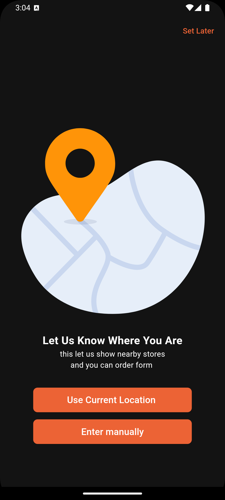{height=250px}
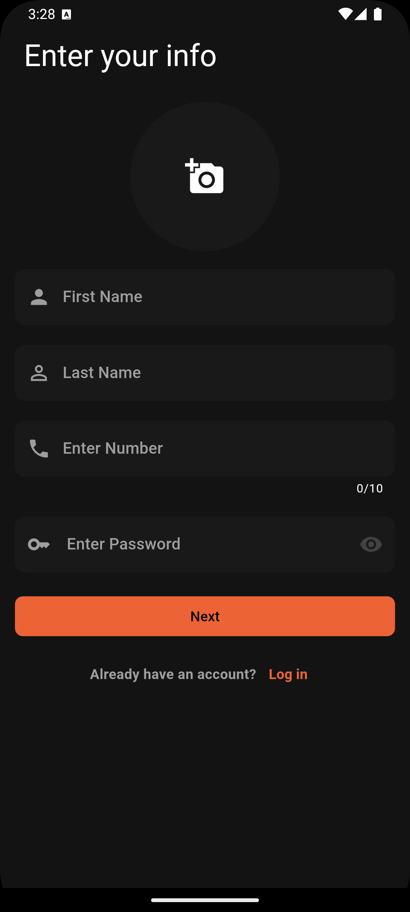
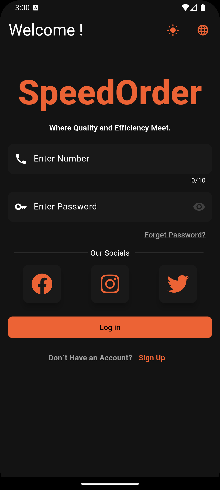
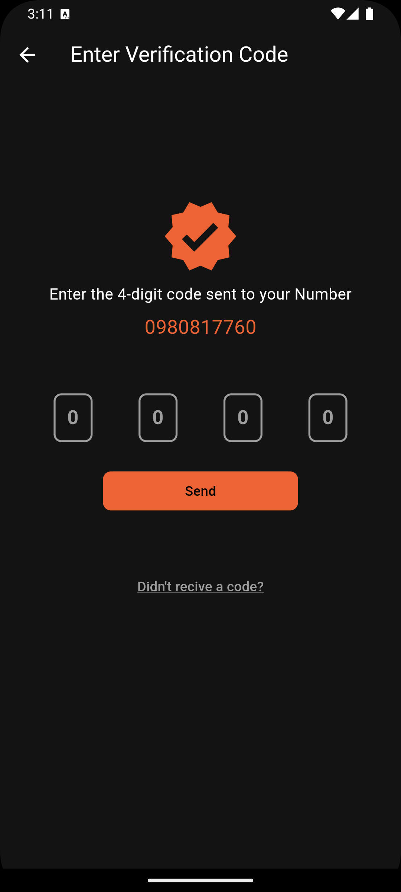
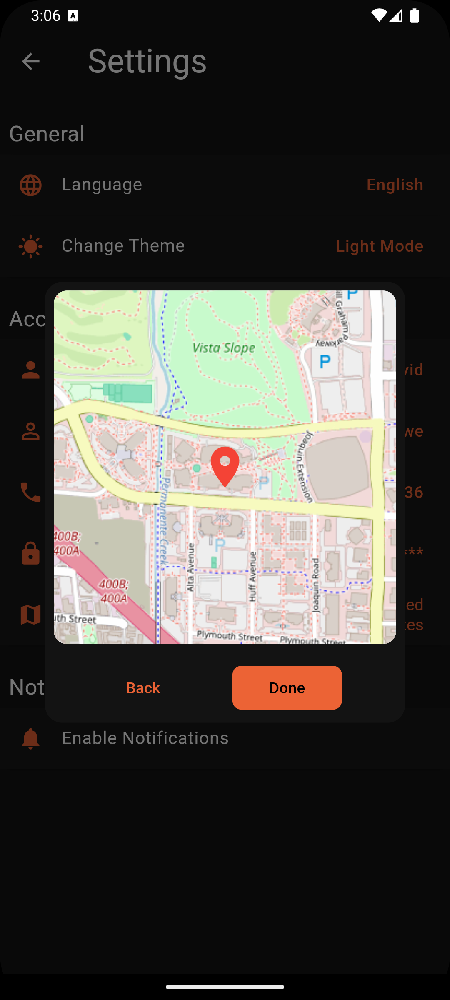
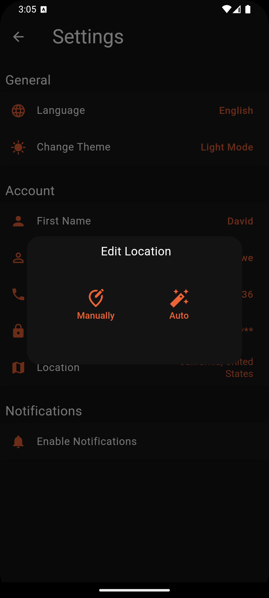
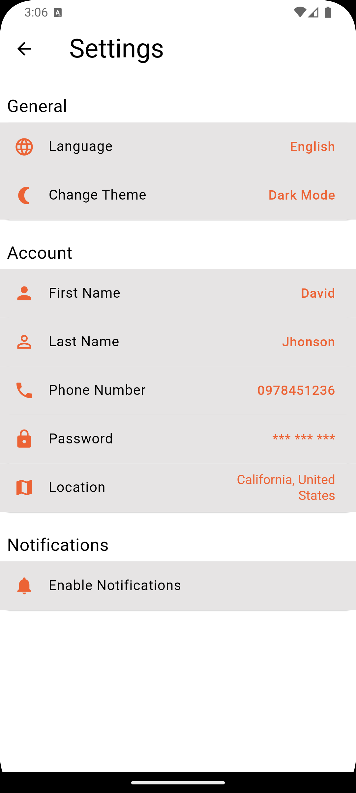
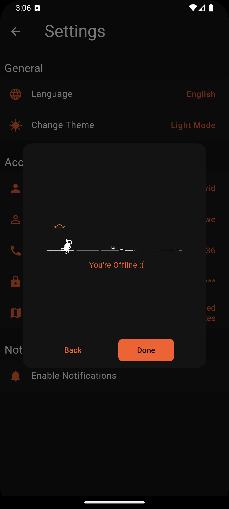
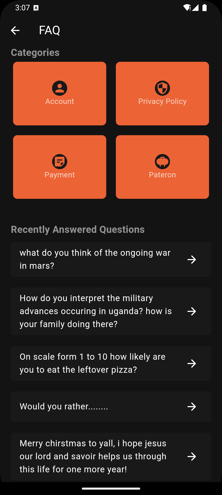
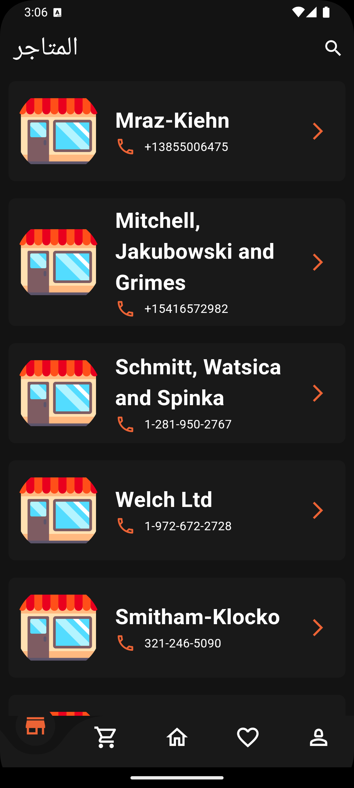
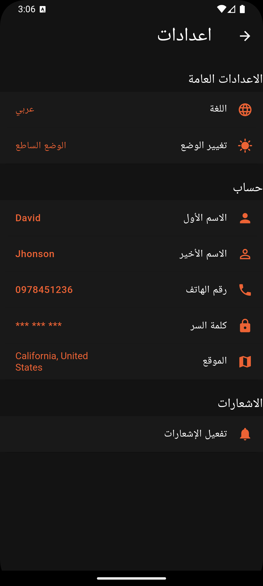

